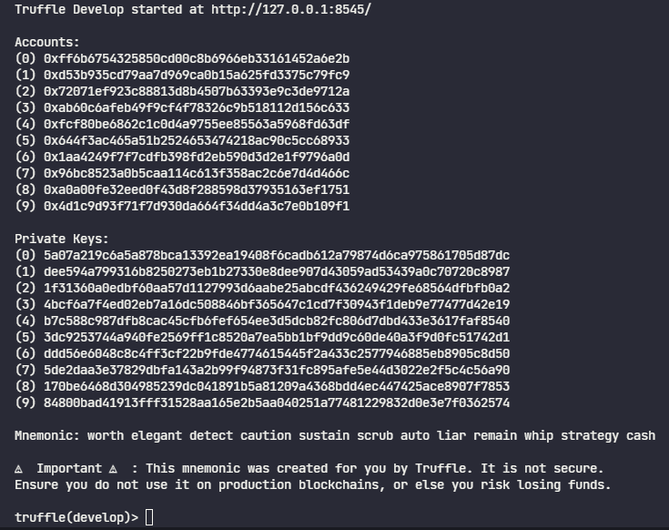
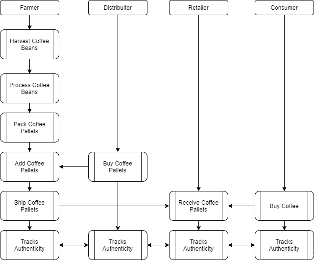
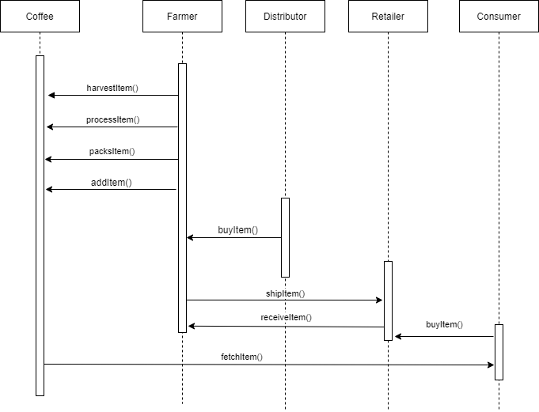
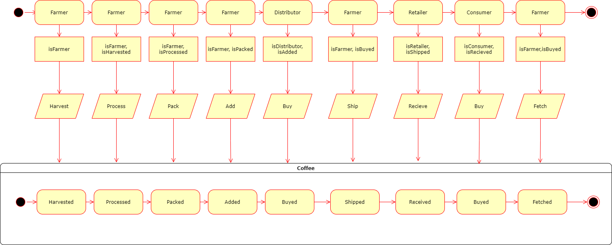
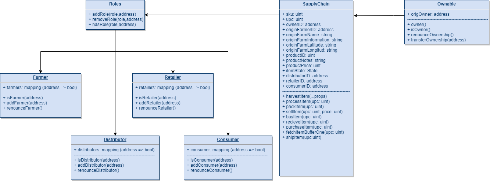

## Coffee Supply Chained

To Create this proyect I used the truffle box with React. [box](https://www.trufflesuite.com/boxes/react).

## Getting Started

These instructions will get you a copy of the project up and running on your local machine for development and testing purposes. See deployment for notes on how to deploy the project on a live system.

### Prerequisites

Please make sure you've already installed Truffe and enabled MetaMask extension in your browser.

```
- Truffle v5.4.3
- Solidity>=0.4.21 <0.7.0
```

### Installing

A step by step series of examples that tell you have to get a development env running

Clone this repository:

```
git clone git@github.com:JdgaleTorre/CoffeeSupplyChain.git
```

Change directory to `client` folder and install all requisite npm packages (as listed in `package.json`):

```
cd client
npm install
```

Launch Truffle:

```
truffle develop
```

Your terminal should look something like this:



Compile smart contracts:

```
compile
```

This will create the smart contract artifacts in folder `client\src\contracts`.

Migrate smart contracts to the locally running blockchain, truffle:

```
migrate
```

Test smart contracts:

```
truffle test
```

In a separate terminal window, launch the DApp:

```
cd client
npm start
```

## UML files

## Activity - [drawio](./UML/Activity.drawio) - [PNG](./UML/Activity.png)



## Sequence - [drawio](./UML/Sequence.drawio) - [PNG](./UML/Sequence.png)



## State - [drawio](./UML/State.drawio) - [PNG](./UML/State.png)



## Class (Data Model) - [drawio](./UML/Class.drawio) - [PNG](./UML/Class.png)



## Test Mnemonic

Mnemonic: worth elegant detect caution sustain scrub auto liar remain whip strategy cash
